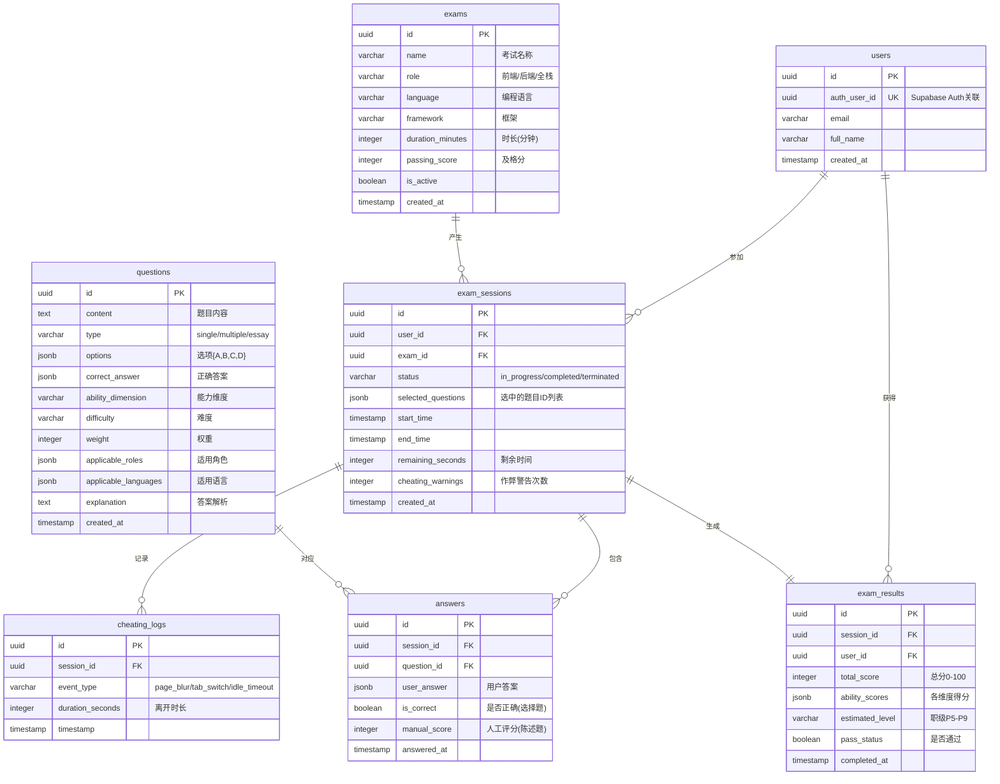

# 数据库Schema设计 - 技术能力评估系统

**技术栈：** Drizzle ORM + PostgreSQL (Supabase)
**创建日期：** 2025-10-28

---

## 一、ER关系图



---

## 二、表结构详细设计

### 2.1 用户表 (users)

**作用：** 关联Supabase Auth，存储用户基本信息

```typescript
export const usersTable = pgTable('users', {
  id: uuid('id').defaultRandom().primaryKey(),
  auth_user_id: uuid('auth_user_id').notNull().unique(),
  email: varchar('email', { length: 255 }).notNull(),
  full_name: varchar('full_name', { length: 255 }),
  role: varchar('role', { length: 50 }).default('candidate'), // 'candidate' | 'admin'
  created_at: timestamp('created_at').defaultNow(),
  updated_at: timestamp('updated_at').defaultNow(),
});
```

**索引：**
```sql
CREATE UNIQUE INDEX idx_users_auth_user_id ON users(auth_user_id);
CREATE INDEX idx_users_email ON users(email);
```

**说明：**
- `auth_user_id`：关联到 Supabase Auth 的 `auth.users.id`
- `role`：用于区分候选人和管理员（评阅权限）
- MVP阶段可通过后台直接修改role字段授予管理员权限

---

### 2.2 考试模板表 (exams)

**作用：** 定义不同类型的考试配置（可支持未来多种考试模板）

```typescript
export const examsTable = pgTable('exams', {
  id: uuid('id').defaultRandom().primaryKey(),
  name: varchar('name', { length: 255 }).notNull(),
  description: text('description'),
  role: varchar('role', { length: 50 }).notNull(), // 'frontend' | 'backend' | 'fullstack'
  language: varchar('language', { length: 50 }).notNull(), // 'typescript' | 'java' | 'python'
  framework: varchar('framework', { length: 100 }), // 'nextjs' | 'react' | 'spring' | 'django' | 'express'
  duration_minutes: integer('duration_minutes').default(10).notNull(),
  passing_score: integer('passing_score').default(60).notNull(),
  total_questions: integer('total_questions').default(20).notNull(),
  is_active: boolean('is_active').default(true).notNull(),
  created_at: timestamp('created_at').defaultNow(),
  updated_at: timestamp('updated_at').defaultNow(),
});
```

**索引：**
```sql
CREATE INDEX idx_exams_role_language ON exams(role, language);
CREATE INDEX idx_exams_is_active ON exams(is_active);
```

**示例数据：**
```sql
INSERT INTO exams (name, role, language, framework) VALUES
  ('前端工程师-TypeScript-Next.js', 'frontend', 'typescript', 'nextjs'),
  ('后端工程师-Java-Spring', 'backend', 'java', 'spring'),
  ('后端工程师-Python-Django', 'backend', 'python', 'django');
```

---

### 2.3 题库表 (questions)

**作用：** 存储所有题目（选择题、陈述题）

```typescript
export const questionsTable = pgTable('questions', {
  id: uuid('id').defaultRandom().primaryKey(),
  content: text('content').notNull(),
  type: varchar('type', { length: 20 }).notNull(), // 'single' | 'multiple' | 'essay'
  options: jsonb('options'), // { "A": "选项A内容", "B": "...", "C": "...", "D": "..." }
  correct_answer: jsonb('correct_answer'), // ['A'] 或 ['A', 'C'] 或 null(陈述题)
  ability_dimension: varchar('ability_dimension', { length: 50 }).notNull(),
  // 'code_design' | 'architecture' | 'database' | 'devops'
  difficulty: varchar('difficulty', { length: 20 }).notNull(), // 'easy' | 'medium' | 'hard'
  weight: integer('weight').default(1).notNull(), // 选择题通常为1，陈述题为5
  applicable_roles: jsonb('applicable_roles').notNull(), // ['frontend', 'backend'] 或 ['fullstack']
  applicable_languages: jsonb('applicable_languages'), // ['typescript'] 或 null(全语言通用)
  explanation: text('explanation'), // 答案解析
  reference_answer: text('reference_answer'), // 陈述题参考答案
  created_by: uuid('created_by'), // 出题人（未来功能）
  created_at: timestamp('created_at').defaultNow(),
  updated_at: timestamp('updated_at').defaultNow(),
});
```

**索引：**
```sql
CREATE INDEX idx_questions_ability_dimension ON questions(ability_dimension);
CREATE INDEX idx_questions_difficulty ON questions(difficulty);
CREATE INDEX idx_questions_type ON questions(type);
-- GIN索引用于JSONB数组查询
CREATE INDEX idx_questions_applicable_roles ON questions USING GIN (applicable_roles);
CREATE INDEX idx_questions_applicable_languages ON questions USING GIN (applicable_languages);
```

**JSONB字段示例：**

```json
// 单选题
{
  "content": "在React中，以下哪种方式最符合处理副作用的最佳实践？",
  "type": "single",
  "options": {
    "A": "const [data, setData] = useState(fetchData())",
    "B": "useEffect(() => { fetchData().then(setData) }, [])",
    "C": "const data = useMemo(() => fetchData(), [])",
    "D": "以上都不推荐"
  },
  "correct_answer": ["B"],
  "ability_dimension": "code_design",
  "difficulty": "easy",
  "weight": 1,
  "applicable_roles": ["frontend", "fullstack"],
  "applicable_languages": ["typescript"],
  "explanation": "副作用（如数据获取）应该在useEffect中处理..."
}

// 多选题
{
  "content": "以下关于数据库索引的说法，哪些是正确的？",
  "type": "multiple",
  "options": {
    "A": "在高频查询的列上创建索引可以显著提升性能",
    "B": "索引越多越好",
    "C": "联合索引(a,b,c)可用于WHERE a=1 AND b=2",
    "D": "WHERE子句中使用函数会导致索引失效"
  },
  "correct_answer": ["A", "C", "D"],
  "applicable_roles": ["backend", "fullstack"],
  "applicable_languages": null
}

// 陈述题
{
  "content": "你需要设计一个电商订单服务（QPS 10000+），请描述你的架构设计...",
  "type": "essay",
  "options": null,
  "correct_answer": null,
  "ability_dimension": "architecture",
  "difficulty": "hard",
  "weight": 5,
  "applicable_roles": ["backend", "fullstack"],
  "applicable_languages": null,
  "explanation": "评分标准：缓存策略1分、数据库分片1分、消息队列1分、幂等性1分、整体合理性1分",
  "reference_answer": "参考方案：Redis缓存热点数据、订单表按用户ID分片、Kafka异步处理、雪花算法生成订单号..."
}
```

---

### 2.4 考试会话表 (exam_sessions)

**作用：** 记录每次考试的会话状态

```typescript
export const examSessionsTable = pgTable('exam_sessions', {
  id: uuid('id').defaultRandom().primaryKey(),
  user_id: uuid('user_id').notNull().references(() => usersTable.id, { onDelete: 'cascade' }),
  exam_id: uuid('exam_id').notNull().references(() => examsTable.id, { onDelete: 'cascade' }),
  status: varchar('status', { length: 20 }).notNull().default('in_progress'),
  // 'in_progress' | 'completed' | 'terminated' (作弊强制结束)
  selected_questions: jsonb('selected_questions').notNull(), // [question_id, question_id, ...]
  start_time: timestamp('start_time').notNull().defaultNow(),
  end_time: timestamp('end_time'),
  remaining_seconds: integer('remaining_seconds').default(600), // 剩余时间（用于恢复会话）
  cheating_warnings: integer('cheating_warnings').default(0).notNull(),
  created_at: timestamp('created_at').defaultNow(),
});
```

**索引：**
```sql
CREATE INDEX idx_exam_sessions_user_id ON exam_sessions(user_id);
CREATE INDEX idx_exam_sessions_status ON exam_sessions(status);
CREATE INDEX idx_exam_sessions_created_at ON exam_sessions(created_at DESC);
```

**约束：**
```sql
-- 同一用户同一时间只能有一个进行中的会话
CREATE UNIQUE INDEX idx_exam_sessions_user_in_progress
ON exam_sessions(user_id)
WHERE status = 'in_progress';
```

**说明：**
- `selected_questions`：记录本次考试的题目ID，保证刷新后题目不变
- `remaining_seconds`：用于断线重连后恢复倒计时
- `cheating_warnings`：累计作弊警告次数，达到5次自动终止

---

### 2.5 答案记录表 (answers)

**作用：** 存储用户的答题记录

```typescript
export const answersTable = pgTable('answers', {
  id: uuid('id').defaultRandom().primaryKey(),
  session_id: uuid('session_id').notNull().references(() => examSessionsTable.id, { onDelete: 'cascade' }),
  question_id: uuid('question_id').notNull().references(() => questionsTable.id, { onDelete: 'cascade' }),
  user_answer: jsonb('user_answer'), // ['A'] 或 ['A', 'C'] 或 "essay text"
  is_correct: boolean('is_correct'), // 选择题自动判定，陈述题为null
  manual_score: integer('manual_score'), // 陈述题人工评分 0-5
  graded_by: uuid('graded_by'), // 评阅人ID（管理员）
  graded_at: timestamp('graded_at'), // 评阅时间
  answered_at: timestamp('answered_at').defaultNow(),
  updated_at: timestamp('updated_at').defaultNow(),
});
```

**索引：**
```sql
CREATE INDEX idx_answers_session_id ON answers(session_id);
CREATE INDEX idx_answers_question_id ON answers(question_id);
CREATE UNIQUE INDEX idx_answers_session_question ON answers(session_id, question_id);
```

**约束：**
```sql
-- 同一会话同一题目只能有一条答案记录（更新时使用upsert）
```

**JSONB字段示例：**
```json
// 单选题答案
{
  "user_answer": ["B"],
  "is_correct": true
}

// 多选题答案
{
  "user_answer": ["A", "C", "D"],
  "is_correct": true
}

// 陈述题答案
{
  "user_answer": "我的架构设计方案是：\n1. 使用Redis缓存...\n2. 数据库采用分库分表...",
  "is_correct": null,
  "manual_score": 4
}
```

---

### 2.6 作弊日志表 (cheating_logs)

**作用：** 记录所有可疑的作弊行为，用于后续审计

```typescript
export const cheatingLogsTable = pgTable('cheating_logs', {
  id: uuid('id').defaultRandom().primaryKey(),
  session_id: uuid('session_id').notNull().references(() => examSessionsTable.id, { onDelete: 'cascade' }),
  event_type: varchar('event_type', { length: 50 }).notNull(),
  // 'page_blur' | 'tab_switch' | 'idle_timeout' | 'copy_paste'
  duration_seconds: integer('duration_seconds'), // 离开页面时长（tab_switch时有值）
  metadata: jsonb('metadata'), // 额外信息（如复制的文本内容）
  created_at: timestamp('created_at').defaultNow(), // 统一使用created_at而非timestamp
});
```

**索引：**
```sql
CREATE INDEX idx_cheating_logs_session_id ON cheating_logs(session_id);
CREATE INDEX idx_cheating_logs_event_type ON cheating_logs(event_type);
CREATE INDEX idx_cheating_logs_created_at ON cheating_logs(created_at DESC);
```

**示例数据：**
```json
{
  "event_type": "tab_switch",
  "duration_seconds": 45,
  "metadata": {
    "user_agent": "Mozilla/5.0...",
    "screen_resolution": "1920x1080"
  }
}
```

---

### 2.7 考试结果表 (exam_results)

**作用：** 存储考试的最终评估结果

```typescript
export const examResultsTable = pgTable('exam_results', {
  id: uuid('id').defaultRandom().primaryKey(),
  session_id: uuid('session_id').notNull().unique().references(() => examSessionsTable.id, { onDelete: 'cascade' }),
  user_id: uuid('user_id').notNull().references(() => usersTable.id, { onDelete: 'cascade' }),
  total_score: integer('total_score').notNull(), // 0-100
  ability_scores: jsonb('ability_scores').notNull(),
  // { "code_design": 80, "architecture": 70, "database": 85, "devops": 60 }
  estimated_level: varchar('estimated_level', { length: 20 }).notNull(), // 'P5' | 'P6' | 'P7' | 'P8' | 'P9' (MVP仅支持P级)
  pass_status: boolean('pass_status').notNull(),
  completed_at: timestamp('completed_at').defaultNow(),

  // MVP不持久化以下字段，改为动态计算：
  // - google_level (V2功能)
  // - percentile (结果页动态计算)
  // - strengths (结果页动态计算)
  // - weaknesses (结果页动态计算)
});
```

**索引：**
```sql
CREATE UNIQUE INDEX idx_exam_results_session_id ON exam_results(session_id);
CREATE INDEX idx_exam_results_user_id ON exam_results(user_id);
CREATE INDEX idx_exam_results_total_score ON exam_results(total_score DESC);
CREATE INDEX idx_exam_results_estimated_level ON exam_results(estimated_level);
```

**JSONB字段示例（MVP精简版）：**
```json
{
  "ability_scores": {
    "code_design": 80,
    "architecture": 78,
    "database": 78,
    "devops": 100
  }
}
```

**动态计算字段（结果页实时生成，不持久化）：**
```typescript
// strengths: 取ability_scores中最高的2个维度
// weaknesses: 取ability_scores中最低的2个维度
// percentile: 根据total_score在所有结果中的排名计算
```

---

## 三、数据库迁移脚本

### 3.1 创建Schema文件

```bash
# 创建 db/schema.ts 文件
# 内容见上述表结构定义
```

### 3.2 生成迁移文件

```bash
pnpm db:generate
# 生成 drizzle/0000_xxx.sql
```

### 3.3 应用迁移

```bash
pnpm db:migrate
# 在Supabase数据库中创建所有表
```

### 3.4 验证

```bash
pnpm db:studio
# 打开 Drizzle Studio 查看表结构
```

---

## 四、种子数据脚本

### 4.1 创建种子数据文件

```typescript
// db/seed.ts
import { db } from './index';
import { examsTable, questionsTable, usersTable } from './schema';
import { codeDesignQuestions, architectureQuestions, databaseQuestions, devopsQuestions } from './seed-data/questions';

async function seed() {
  console.log('🌱 开始种子数据导入...');

  // 1. 创建默认考试模板
  await db.insert(examsTable).values([
    {
      name: '前端工程师能力评估-TypeScript-Next.js',
      role: 'frontend',
      language: 'typescript',
      framework: 'nextjs',
      duration_minutes: 10,
      passing_score: 60,
      total_questions: 20,
      is_active: true,
    },
    {
      name: '后端工程师能力评估-Java-Spring',
      role: 'backend',
      language: 'java',
      framework: 'spring',
      duration_minutes: 10,
      passing_score: 60,
      total_questions: 20,
      is_active: true,
    },
    // ... 更多模板
  ]);

  // 2. 导入题库（80题）
  await db.insert(questionsTable).values([
    ...codeDesignQuestions,
    ...architectureQuestions,
    ...databaseQuestions,
    ...devopsQuestions,
  ]);

  console.log('✅ 种子数据导入完成！');
}

seed().catch(console.error);
```

### 4.2 题库数据文件结构

```typescript
// db/seed-data/questions.ts
export const codeDesignQuestions = [
  {
    content: "在React中，以下哪种方式最符合处理副作用的最佳实践？",
    type: "single",
    options: {
      A: "const [data, setData] = useState(fetchData())",
      B: "useEffect(() => { fetchData().then(setData) }, [])",
      C: "const data = useMemo(() => fetchData(), [])",
      D: "以上都不推荐"
    },
    correct_answer: ["B"],
    ability_dimension: "code_design",
    difficulty: "easy",
    weight: 1,
    applicable_roles: ["frontend", "fullstack"],
    applicable_languages: ["typescript"],
    explanation: "副作用（如数据获取）应该在useEffect中处理，避免在渲染过程中执行异步操作。选项A会在每次渲染时调用fetchData，选项C的useMemo用于计算派生值而非处理副作用。"
  },
  // ... 更多题目（总计20题 × 4维度 = 80题）
];
```

### 4.3 运行种子脚本

```bash
# package.json 添加脚本
"scripts": {
  "db:seed": "tsx db/seed.ts"
}

# 运行
pnpm db:seed
```

---

## 五、查询示例（Drizzle ORM）

### 5.1 创建考试会话

```typescript
import { db } from '@/db';
import { examSessionsTable } from '@/db/schema';

const session = await db.insert(examSessionsTable).values({
  user_id: userId,
  exam_id: examId,
  selected_questions: selectedQuestionIds, // 从题目选择算法获取
  start_time: new Date(),
  remaining_seconds: 600,
  status: 'in_progress',
}).returning();
```

### 5.2 保存答案（Upsert）

```typescript
import { db } from '@/db';
import { answersTable } from '@/db/schema';
import { eq, and } from 'drizzle-orm';

await db
  .insert(answersTable)
  .values({
    session_id: sessionId,
    question_id: questionId,
    user_answer: userAnswer,
  })
  .onConflictDoUpdate({
    target: [answersTable.session_id, answersTable.question_id],
    set: {
      user_answer: userAnswer,
      updated_at: new Date(),
    },
  });
```

### 5.3 获取考试结果（Join查询）

```typescript
import { db } from '@/db';
import { examResultsTable, examSessionsTable, usersTable } from '@/db/schema';
import { eq } from 'drizzle-orm';

const result = await db
  .select({
    result: examResultsTable,
    session: examSessionsTable,
    user: {
      email: usersTable.email,
      full_name: usersTable.full_name,
    },
  })
  .from(examResultsTable)
  .innerJoin(examSessionsTable, eq(examResultsTable.session_id, examSessionsTable.id))
  .innerJoin(usersTable, eq(examResultsTable.user_id, usersTable.id))
  .where(eq(examResultsTable.session_id, sessionId))
  .limit(1);
```

### 5.4 获取待评阅的陈述题

```typescript
import { db } from '@/db';
import { answersTable, questionsTable, usersTable, examSessionsTable } from '@/db/schema';
import { eq, and, isNull } from 'drizzle-orm';

const pendingEssays = await db
  .select({
    answer: answersTable,
    question: questionsTable,
    user: {
      email: usersTable.email,
      full_name: usersTable.full_name,
    },
  })
  .from(answersTable)
  .innerJoin(questionsTable, eq(answersTable.question_id, questionsTable.id))
  .innerJoin(examSessionsTable, eq(answersTable.session_id, examSessionsTable.id))
  .innerJoin(usersTable, eq(examSessionsTable.user_id, usersTable.id))
  .where(
    and(
      eq(questionsTable.type, 'essay'),
      isNull(answersTable.manual_score),
      eq(examSessionsTable.status, 'completed')
    )
  )
  .orderBy(answersTable.answered_at);
```

### 5.5 统计候选人排名（百分位）（V2示例 - 动态计算，不落库）

> **注：** 百分位是V2功能，在结果页动态计算展示，不持久化到数据库。

```typescript
import { db } from '@/db';
import { examResultsTable } from '@/db/schema';
import { sql, gt } from 'drizzle-orm';

// 动态计算百分位排名（V2功能）
const totalCandidates = await db
  .select({ count: sql<number>`count(*)` })
  .from(examResultsTable);

const higherScores = await db
  .select({ count: sql<number>`count(*)` })
  .from(examResultsTable)
  .where(gt(examResultsTable.total_score, currentScore));

// 百分位：超过了X%的候选人
const percentile = Math.round((higherScores / totalCandidates) * 100);
```

---

## 六、性能优化建议

### 6.1 索引策略
- ✅ 在所有外键上创建索引
- ✅ 在查询条件字段上创建索引（如status、created_at）
- ✅ 对JSONB数组字段使用GIN索引
- ✅ 创建复合索引优化常用查询

### 6.2 分区策略（未来优化）
```sql
-- 当数据量超过100万时，考虑按时间分区
CREATE TABLE exam_sessions_2025_q1 PARTITION OF exam_sessions
FOR VALUES FROM ('2025-01-01') TO ('2025-04-01');
```

### 6.3 缓存策略
- 题库数据缓存到Redis（很少变更）
- 考试会话状态缓存（频繁读写）
- 排行榜数据缓存（定时刷新）

### 6.4 连接池配置
```typescript
// db/index.ts
import { drizzle } from 'drizzle-orm/postgres-js';
import postgres from 'postgres';

const connectionString = process.env.DATABASE_URL!;

const client = postgres(connectionString, {
  max: 10, // 连接池大小
  idle_timeout: 20,
  connect_timeout: 10,
  // 如果使用Supabase Transaction模式，需要添加:
  // prepare: false,
});

export const db = drizzle(client);
```

---

## 七、安全性考虑

### 7.1 Row Level Security (RLS)
```sql
-- 在Supabase中启用RLS
ALTER TABLE exam_sessions ENABLE ROW LEVEL SECURITY;
ALTER TABLE answers ENABLE ROW LEVEL SECURITY;
ALTER TABLE exam_results ENABLE ROW LEVEL SECURITY;

-- 用户只能查看自己的会话
CREATE POLICY "Users can view own sessions"
ON exam_sessions FOR SELECT
USING (auth.uid() = user_id);

-- 用户只能插入自己的答案
CREATE POLICY "Users can insert own answers"
ON answers FOR INSERT
WITH CHECK (
  EXISTS (
    SELECT 1 FROM exam_sessions
    WHERE id = session_id
    AND user_id = auth.uid()
  )
);
```

### 7.2 敏感数据保护
- ❌ 前端不暴露正确答案（API只返回题目内容和选项）
- ❌ 题目详情API需要验证会话归属
- ✅ 评分逻辑放在后端Server Action
- ✅ 管理员权限验证（评阅接口）

---

## 八、备份与恢复

### 8.1 自动备份
Supabase自动提供：
- 每日自动备份（保留7天）
- Point-in-time recovery（付费功能）

### 8.2 手动备份
```bash
# 使用pg_dump导出
pg_dump -h db.xxx.supabase.co -U postgres -d postgres > backup.sql

# 恢复
psql -h db.xxx.supabase.co -U postgres -d postgres < backup.sql
```

---

## 九、监控指标

建议监控的关键指标：
- 每日新增考试会话数
- 考试完成率（completed / total）
- 作弊行为触发率（terminated / total）
- 平均考试时长
- 各维度平均得分
- 题目难度校准（正确率统计）

---

**文档维护者：** Tech Team
**最后更新：** 2025-10-28
